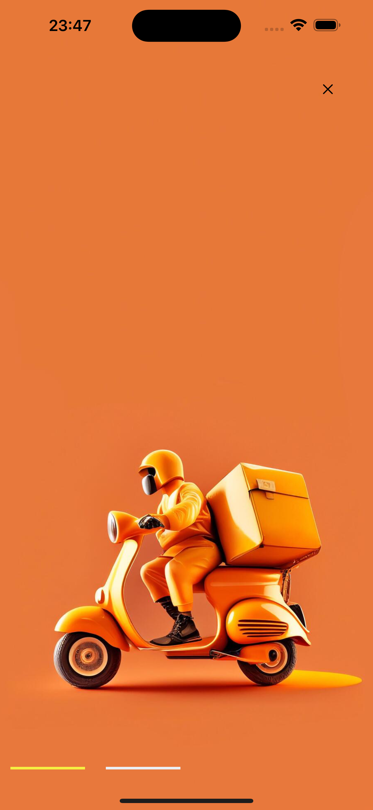
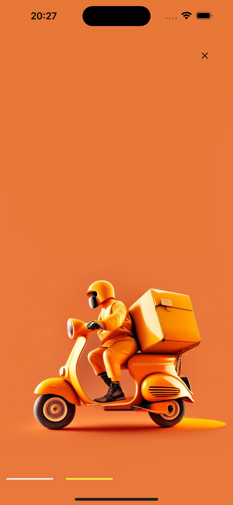
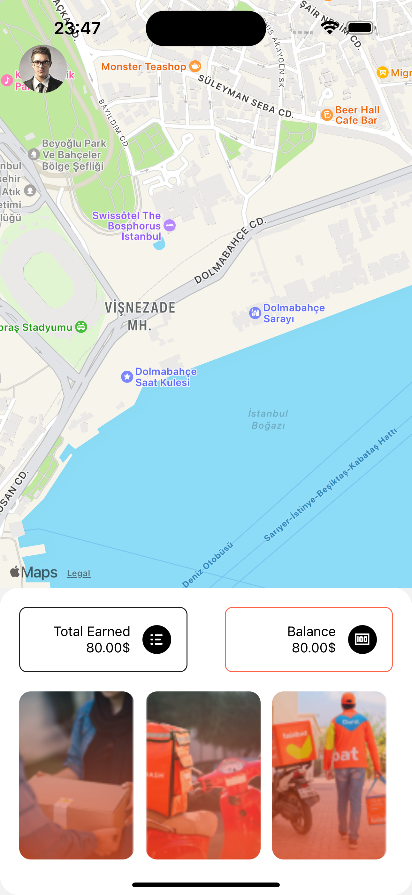
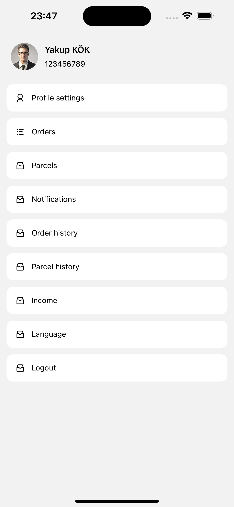
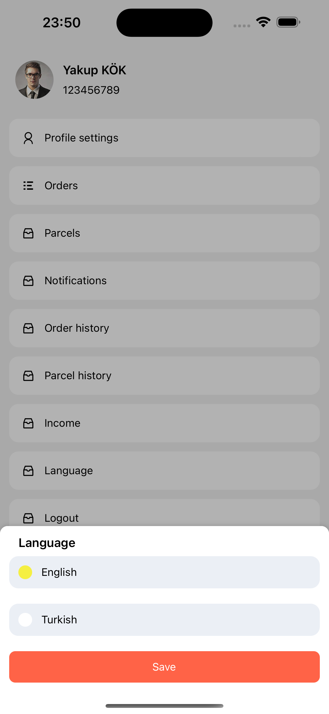
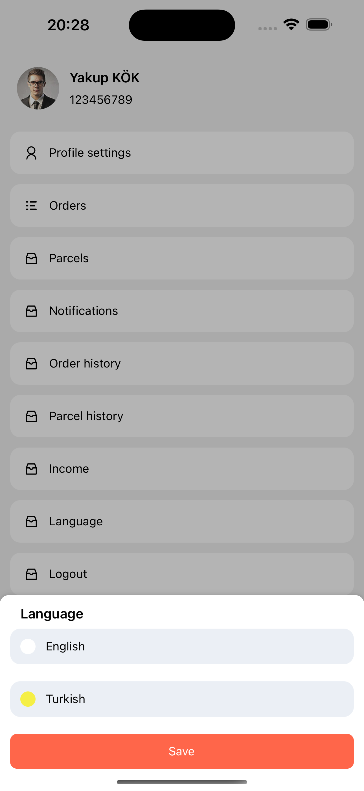

# CatchMarket

## Getting Started with React Native App

This project was bootstrapped with [React Native 0.70.14](https://github.com/facebook/react-native).

## Learn More

You can learn more in the [Create React Native App documentation](https://github.com/facebook/react-native).

To learn React Native, check out the [React Native documentation](https://reactnative.dev/).

**Splash**

**Splash2**

**Map**

**Settings**

**Language**

**Language2**

